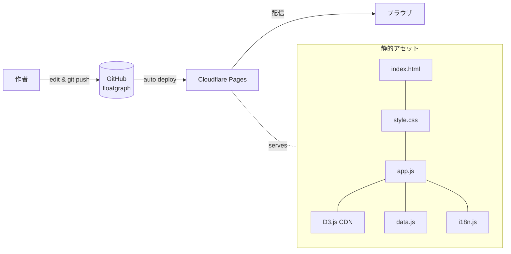
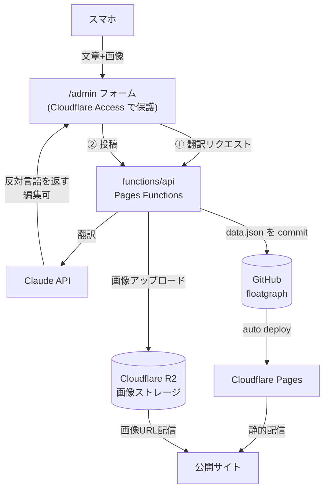

# floatgraph

Obsidian のグラフビューにインスパイアされた、ふわふわ浮遊するノードサイト。

**Live:** https://floatin.mep-std.com  
**Repo:** https://github.com/r-mep/floatgraph

## 機能

- D3.js フォースシミュレーションによるノードの浮遊・ドラッグ・ズーム
- ノードをタップ/クリックすると詳細パネルが開く（アイコン・説明・写真グリッド）
- 多対多のノード間リンク
- ja / en 切り替え（localStorage で記憶）
- ダーク / ライトモード（OS 自動追従 + 手動上書き、localStorage で記憶）
- レスポンシブ対応（デスクトップ: サイドパネル / モバイル: ボトムシート）

## ファイル構成

```
floatgraph/
├── index.html   # エントリーポイント。ボタン・パネルの HTML 構造
├── style.css    # 全スタイル。テーマ変数は :root / [data-theme] で管理
├── i18n.js      # UI 文字列（ja / en）。ノードコンテンツとは別管理
├── data.js      # ノードとリンクのデータ。ここだけ編集すれば内容を変えられる
└── app.js       # D3 グラフ + パネル + 言語 + テーマのロジック
```

## 技術スタック

| レイヤ | 採用技術 | 備考 |
|---|---|---|
| フロントエンド | 素の HTML / CSS / JS | **ビルドツールなし**。`index.html` を開けば動く |
| 可視化 | D3.js（CDN） | フォースシミュレーションによるノードの浮遊・ドラッグ・ズーム |
| ホスティング | Cloudflare Pages | `main` への push で自動デプロイ（ビルドステップなし） |
| ドメイン / DNS | Cloudflare | `floatin.mep-std.com` → CNAME → `floatgraph.pages.dev` |
| データ | `data.js`（静的） | プレーンな JS オブジェクト。ここを編集すれば内容が変わる |

意図的にフレームワークもバンドラも持たない構成にしている。背景は
[ADR-0001](./docs/adr/0001-static-no-build-stack.md) を参照。

### 投稿システム（計画中）

スマホから文章＋画像を投稿してノードを増やせる仕組みを追加予定。Cloudflare ネイティブ構成で、
**公開サイトは静的のまま維持し、投稿だけをサーバー側機能で足す**。詳細・選定理由は
[ADR-0002](./docs/adr/0002-mobile-posting-system.md) を参照。

- 画像 → **Cloudflare R2**（git を肥大化させない画像ストレージ）
- データ書き込み → `data.json` を **GitHub API で commit**（公開サイトは従来通りこれを読むだけ）
- 認証 → **Cloudflare Access**（作者のメールのみに制限）
- 翻訳 → **Claude API**（片方の言語を書くと反対言語を生成 → 編集して保存）

## アーキテクチャ

### 現在（静的サイト）



### 計画中（投稿システム込み）



> 設計判断の記録は [`docs/adr/`](./docs/adr/) にまとめている。

## ローカル開発

ビルド不要。ブラウザで直接開くか、ローカルサーバーを立てる。

```bash
python3 -m http.server 8765
# → http://localhost:8765
```

編集 → ブラウザリロード で即確認できる。

## デプロイ

`main` に push すると **Cloudflare Pages が自動でデプロイ**する。

```
git push origin main  # これだけ
```

インフラ構成：
- ホスティング：Cloudflare Pages（`floatgraph.pages.dev`）
- ドメイン：Cloudflare（`mep-std.com`）
- DNS：`floatin.mep-std.com` → CNAME → `floatgraph.pages.dev`

## データの編集

`data.js` を編集するだけ。ビルド・設定変更は不要。

```js
// ノードを追加
{
  id: "unique-id",           // 他と被らない英数字
  icon: "🎵",
  label:       { ja: "日本語ラベル", en: "English label" },
  description: { ja: "説明文（100字程度）", en: "Description" },
  photos: ["./imgs/photo1.jpg"],  // URL または相対パス。省略可
}

// リンクを追加（多対多 OK）
{ source: "node-id-a", target: "node-id-b" }
```

## UI 文字列の追加

ノード以外の固定テキスト（ボタンラベルなど）は `i18n.js` に追加する。

```js
const I18N = {
  ja: { myKey: "日本語テキスト" },
  en: { myKey: "English text" },
};
```

`app.js` 内では `ui("myKey")` で呼び出せる。

## テーマ

CSS 変数（`--bg`, `--text-primary` など）が `style.css` の `:root` に定義されている。  
ライトモードは `:root[data-theme="light"]` と `@media (prefers-color-scheme: light)` の両方で上書きしている。  
色を変えたい場合はこの変数を編集するだけでよい。

## 今後やりたいこと

- [ ] 写真を実際のものに差し替え
- [ ] ノードを増やす
- [ ] ノード検索 / フィルター
